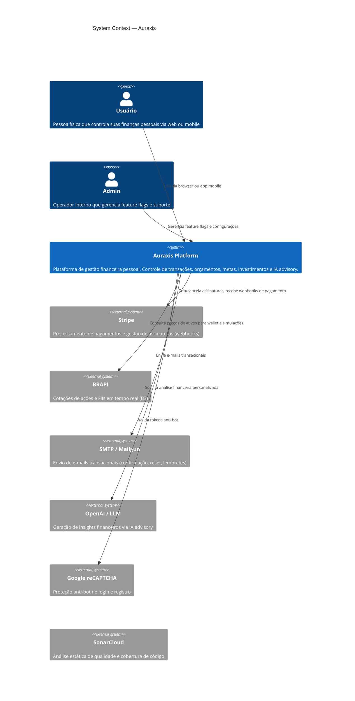

# 01 — System Context (C4 L1)

Visão de mais alto nível: quem usa o Auraxis e com quais sistemas externos ele se integra.

```mermaid
C4Context
    title System Context — Auraxis

    Person(user, "Usuário", "Pessoa física que controla suas finanças pessoais via web ou mobile")
    Person(admin, "Admin", "Operador interno que gerencia feature flags e suporte")

    System(auraxis, "Auraxis Platform", "Plataforma de gestão financeira pessoal. Controle de transações, orçamentos, metas, investimentos e IA advisory.")

    System_Ext(stripe, "Stripe", "Processamento de pagamentos e gestão de assinaturas (webhooks)")
    System_Ext(brapi, "BRAPI", "Cotações de ações e FIIs em tempo real (B3)")
    System_Ext(smtp, "SMTP / Mailgun", "Envio de e-mails transacionais (confirmação, reset, lembretes)")
    System_Ext(openai, "OpenAI / LLM", "Geração de insights financeiros via IA advisory")
    System_Ext(recaptcha, "Google reCAPTCHA", "Proteção anti-bot no login e registro")
    System_Ext(sonar, "SonarCloud", "Análise estática de qualidade e cobertura de código")

    Rel(user, auraxis, "Usa via browser ou app mobile")
    Rel(admin, auraxis, "Gerencia feature flags e configurações")
    Rel(auraxis, stripe, "Cria/cancela assinaturas, recebe webhooks de pagamento")
    Rel(auraxis, brapi, "Consulta preços de ativos para wallet e simulações")
    Rel(auraxis, smtp, "Envia e-mails transacionais")
    Rel(auraxis, openai, "Solicita análise financeira personalizada")
    Rel(auraxis, recaptcha, "Valida tokens anti-bot")

    UpdateLayoutConfig($c4ShapeInRow="3", $c4BoundaryInRow="1")
```
