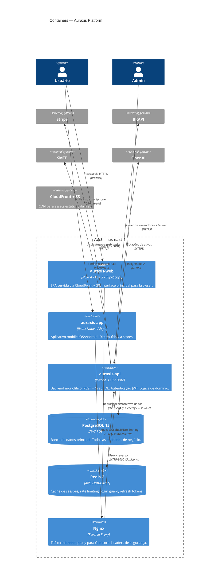

# 02 — Containers (C4 L2)

Os containers que compõem a plataforma Auraxis e como se comunicam.

```mermaid
C4Container
    title Containers — Auraxis Platform

    Person(user, "Usuário")
    Person(admin, "Admin")

    Container_Boundary(aws, "AWS — us-east-1") {
        Container(web, "auraxis-web", "Nuxt 4 / Vue 3 / TypeScript", "SPA servida via CloudFront + S3. Interface principal para browser.")
        Container(app, "auraxis-app", "React Native / Expo", "Aplicativo mobile iOS/Android. Distribuído via stores.")
        Container(api, "auraxis-api", "Python 3.13 / Flask", "Backend monolítico. REST + GraphQL. Autenticação JWT. Lógica de domínio.")
        ContainerDb(postgres, "PostgreSQL 15", "AWS RDS", "Banco de dados principal. Todas as entidades de negócio.")
        ContainerDb(redis, "Redis 7", "AWS ElastiCache", "Cache de sessões, rate limiting, login guard, refresh tokens.")
        Container(nginx, "Nginx", "Reverse Proxy", "TLS termination, proxy para Gunicorn, headers de segurança.")
    }

    System_Ext(stripe, "Stripe")
    System_Ext(brapi, "BRAPI")
    System_Ext(smtp, "SMTP")
    System_Ext(openai, "OpenAI")
    System_Ext(cdn, "CloudFront + S3", "CDN para assets estáticos da web")

    Rel(user, web, "Acessa via HTTPS", "browser")
    Rel(user, app, "Usa no smartphone", "iOS/Android")
    Rel(admin, api, "Gerencia via endpoints /admin", "HTTPS")

    Rel(web, nginx, "Requisições de API", "HTTPS/443")
    Rel(app, nginx, "Requisições de API", "HTTPS/443")
    Rel(nginx, api, "Proxy reverso", "HTTP/8000 (Gunicorn)")

    Rel(api, postgres, "Lê/escreve dados", "SQLAlchemy / TCP 5432")
    Rel(api, redis, "Cache e rate limiting", "TCP 6379")
    Rel(api, stripe, "Assinaturas e webhooks", "HTTPS")
    Rel(api, brapi, "Cotações de ativos", "HTTPS")
    Rel(api, smtp, "E-mails transacionais", "SMTP/TLS")
    Rel(api, openai, "Insights de IA", "HTTPS")

    UpdateLayoutConfig($c4ShapeInRow="3", $c4BoundaryInRow="1")
```
