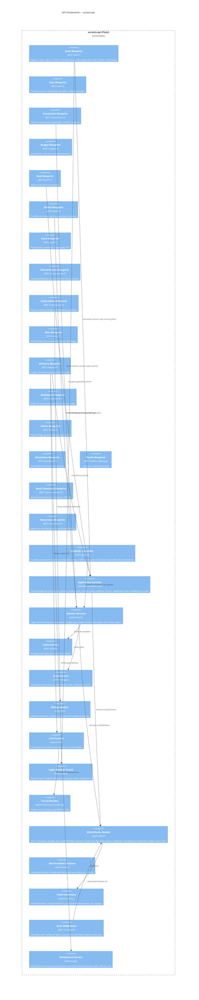

# 03 — API Components (C4 L3)

Componentes internos do `auraxis-api`: blueprints REST, resolvers GraphQL, camada de serviços e extensões.

```mermaid
C4Component
    title API Components — auraxis-api

    Container_Boundary(api, "auraxis-api (Flask)") {

        Component(auth_bp, "Auth Blueprint", "REST /auth/*", "Registro, login, logout, refresh, reset de senha, confirmação de e-mail, sessões multi-device")
        Component(user_bp, "User Blueprint", "REST /user/*", "Perfil do usuário, atualização de dados, deleção de conta")
        Component(tx_bp, "Transaction Blueprint", "REST /transactions/*", "CRUD de transações, exportação CSV/PDF, analytics")
        Component(budget_bp, "Budget Blueprint", "REST /budgets/*", "Orçamentos mensais e acompanhamento")
        Component(goal_bp, "Goal Blueprint", "REST /goals/*", "Metas financeiras e projeções")
        Component(wallet_bp, "Wallet Blueprint", "REST /wallet/*", "Portfólio de investimentos, operações, valuation")
        Component(fiscal_bp, "Fiscal Blueprint", "REST /fiscal/*", "Notas fiscais, recebíveis, importação CSV")
        Component(shared_bp, "Shared Entries Blueprint", "REST /shared-entries/*", "Compartilhamento de lançamentos entre usuários")
        Component(subscription_bp, "Subscription Blueprint", "REST /subscriptions/*", "Planos, checkout Stripe, cancelamento, webhook")
        Component(alert_bp, "Alert Blueprint", "REST /alerts/*", "Alertas financeiros e preferências de notificação")
        Component(advisory_bp, "Advisory Blueprint", "REST /advisory/*", "Insights financeiros gerados por IA (LLM)")
        Component(dashboard_bp, "Dashboard Blueprint", "REST /dashboard/*", "Índice de sobrevivência patrimonial (burn rate)")
        Component(admin_bp, "Admin Blueprint", "REST /admin/*", "Feature flags, gerenciamento operacional")
        Component(simulation_bp, "Simulation Blueprint", "REST /simulations/*", "Simulações financeiras e projeções")
        Component(health_bp, "Health Blueprint", "REST /healthz, /readiness", "Liveness e readiness probes")
        Component(bank_stmt_bp, "Bank Statement Blueprint", "REST /bank-statements/*", "Importação de extratos bancários OFX/CSV")
        Component(recurrence_bp, "Recurrence Blueprint", "REST /recurrences/*", "Regras de recorrência (job desabilitado, MVP2)")

        Component(graphql_ctrl, "GraphQL Controller", "POST /graphql", "Ariadne schema-first. Queries: transações, metas, wallet, simulações. Mutations: operações de investimento.")

        Component(app_services, "Application Services", "app/application/services/", "Orquestração de casos de uso: session_service, auth_security_policy, advisory_service, entitlement, goal, installment_vs_cash")
        Component(domain_services, "Domain Services", "app/services/", "Lógica de domínio pura: transaction, budget, goal, wallet, fiscal, subscription, alert, bank_import")
        Component(cache_svc, "Cache Service", "Redis adapter", "Wrappers para get/set/invalidate no Redis")
        Component(email_svc, "Email Service", "SMTP / Mailgun", "Templates transacionais: confirmação, reset, lembretes D-7/D-1")
        Component(billing_svc, "Billing Adapter", "Stripe SDK", "Checkout sessions, customer management, webhook parsing")
        Component(llm_svc, "LLM Provider", "OpenAI SDK", "Chamadas ao modelo de IA com retry e circuit breaker")
        Component(login_guard, "Login Attempt Guard", "Redis-backed", "Rate limit por e-mail/IP, fallback local quando Redis indisponível")
        Component(circuit_br, "Circuit Breaker", "app/services/circuit_breaker.py", "Padrão circuit breaker para BRAPI e LLM")

        Component(models, "SQLAlchemy Models", "app/models/", "User, Transaction, Budget, Goal, RefreshToken, Account, CreditCard, Tag, Subscription, AuditEvent, SharedEntry, Entitlement, Wallet, Fiscal, Alert")
        Component(schemas, "Marshmallow Schemas", "app/schemas/", "Validação de input e serialização de output para todos os recursos")
        Component(extensions, "Flask Extensions", "app/extensions/", "db (SQLAlchemy), migrate (Alembic), jwt (Flask-JWT-Extended), cors, apispec")
        Component(middleware, "Auth Middleware", "JWT + JTI allowlist", "Decodifica JWT, verifica JTI ativo na tabela RefreshToken, injeta current_user")
        Component(entitlement_svc, "Entitlement Service", "Feature gate", "Verifica tier de assinatura para acesso a recursos premium (export_pdf, advisory, etc)")
    }

    Rel(auth_bp, app_services, "Usa session_service, auth_security_policy")
    Rel(auth_bp, login_guard, "Rate limiting de tentativas de login")
    Rel(tx_bp, domain_services, "Usa transaction_service, export_service")
    Rel(goal_bp, app_services, "Usa goal_application_service")
    Rel(wallet_bp, domain_services, "Usa investment_service, portfolio_valuation")
    Rel(advisory_bp, app_services, "Usa advisory_service")
    Rel(advisory_bp, entitlement_svc, "Verifica gate advisory")
    Rel(subscription_bp, billing_svc, "Stripe checkout e webhooks")
    Rel(advisory_bp, llm_svc, "Solicita análise LLM")
    Rel(graphql_ctrl, domain_services, "Queries e mutations via resolvers")
    Rel(app_services, models, "Persiste via SQLAlchemy")
    Rel(domain_services, models, "Persiste via SQLAlchemy")
    Rel(domain_services, cache_svc, "Cache de resultados")
    Rel(domain_services, email_svc, "Notificações")
    Rel(llm_svc, circuit_br, "Protege chamadas externas")
    Rel(middleware, models, "Verifica RefreshToken JTI")
    Rel(models, extensions, "db.session")
```
