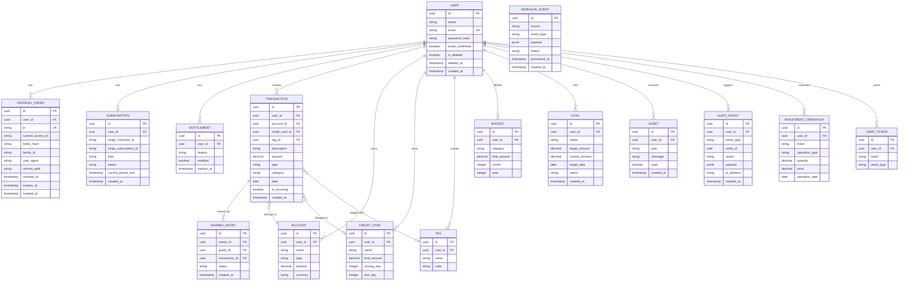

# 04 — Data Model (ER)

Entidades principais do banco de dados e seus relacionamentos.

```mermaid
erDiagram
    USER {
        uuid id PK
        string name
        string email UK
        string password_hash
        boolean email_confirmed
        boolean is_deleted
        timestamp deleted_at
        timestamp created_at
    }

    REFRESH_TOKEN {
        uuid id PK
        uuid user_id FK
        string jti UK
        string current_access_jti
        string token_hash
        string family_id
        string user_agent
        string remote_addr
        timestamp revoked_at
        timestamp expires_at
        timestamp created_at
    }

    SUBSCRIPTION {
        uuid id PK
        uuid user_id FK
        string stripe_customer_id
        string stripe_subscription_id
        string plan
        string status
        timestamp current_period_end
        timestamp created_at
    }

    ENTITLEMENT {
        uuid id PK
        uuid user_id FK
        string feature
        boolean enabled
        timestamp expires_at
    }

    TRANSACTION {
        uuid id PK
        uuid user_id FK
        uuid account_id FK
        uuid credit_card_id FK
        uuid tag_id FK
        string description
        decimal amount
        string type
        string category
        date date
        boolean is_recurring
        timestamp created_at
    }

    ACCOUNT {
        uuid id PK
        uuid user_id FK
        string name
        string type
        decimal balance
        string currency
    }

    CREDIT_CARD {
        uuid id PK
        uuid user_id FK
        string name
        decimal limit_amount
        integer closing_day
        integer due_day
    }

    TAG {
        uuid id PK
        uuid user_id FK
        string name
        string color
    }

    BUDGET {
        uuid id PK
        uuid user_id FK
        string category
        decimal limit_amount
        integer month
        integer year
    }

    GOAL {
        uuid id PK
        uuid user_id FK
        string name
        decimal target_amount
        decimal current_amount
        date target_date
        string status
        timestamp created_at
    }

    ALERT {
        uuid id PK
        uuid user_id FK
        string type
        string message
        boolean read
        timestamp created_at
    }

    AUDIT_EVENT {
        uuid id PK
        uuid user_id FK
        string entity_type
        uuid entity_id
        string action
        jsonb payload
        string ip_address
        timestamp created_at
    }

    SHARED_ENTRY {
        uuid id PK
        uuid owner_id FK
        uuid guest_id FK
        uuid transaction_id FK
        string status
        timestamp created_at
    }

    INVESTMENT_OPERATION {
        uuid id PK
        uuid user_id FK
        string ticker
        string operation_type
        decimal quantity
        decimal price
        date operation_date
    }

    USER_TICKER {
        uuid id PK
        uuid user_id FK
        string ticker
        string asset_type
    }

    WEBHOOK_EVENT {
        uuid id PK
        string source
        string event_type
        jsonb payload
        string status
        timestamp processed_at
        timestamp created_at
    }

    USER ||--o{ REFRESH_TOKEN : "has"
    USER ||--o| SUBSCRIPTION : "has"
    USER ||--o{ ENTITLEMENT : "has"
    USER ||--o{ TRANSACTION : "creates"
    USER ||--o{ ACCOUNT : "owns"
    USER ||--o{ CREDIT_CARD : "owns"
    USER ||--o{ TAG : "creates"
    USER ||--o{ BUDGET : "defines"
    USER ||--o{ GOAL : "sets"
    USER ||--o{ ALERT : "receives"
    USER ||--o{ AUDIT_EVENT : "triggers"
    USER ||--o{ INVESTMENT_OPERATION : "executes"
    USER ||--o{ USER_TICKER : "tracks"
    TRANSACTION ||--o{ SHARED_ENTRY : "shared via"
    TRANSACTION }o--|| ACCOUNT : "belongs to"
    TRANSACTION }o--o| CREDIT_CARD : "charged to"
    TRANSACTION }o--o| TAG : "tagged with"
```
