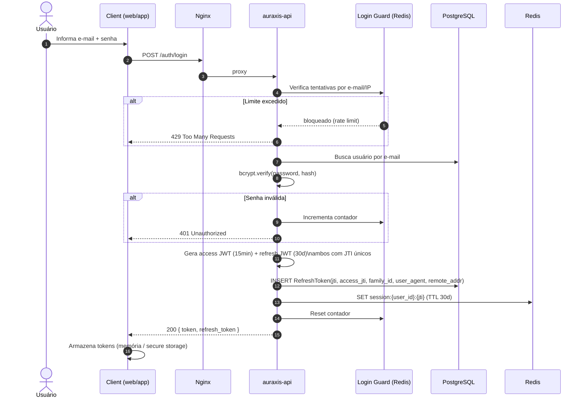
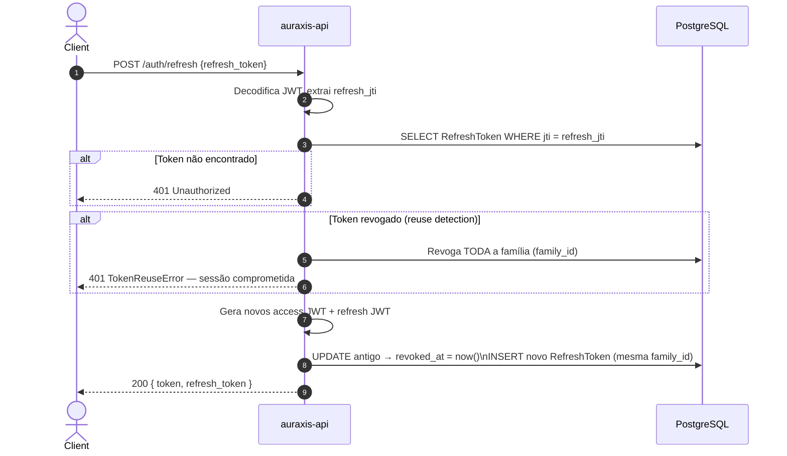
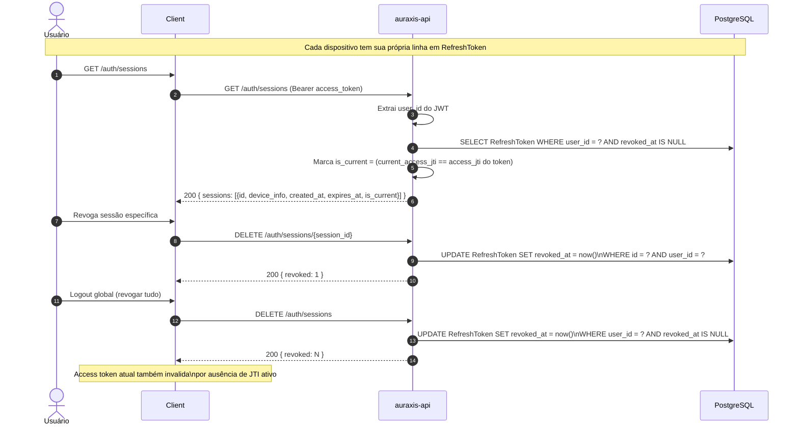
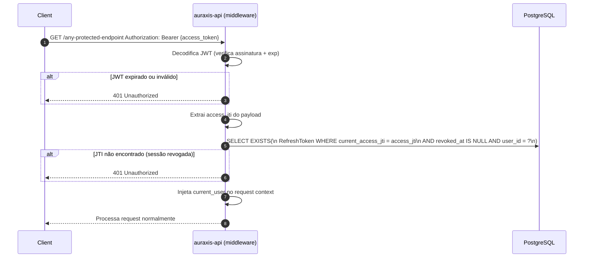

# 05 — Auth Flow

Fluxo completo de autenticação: registro, login, refresh token rotation, multi-device sessions e revogação.

## Login e emissão de tokens

## Refresh Token Rotation

## Multi-Device Sessions

## Validação de Access Token em cada request

