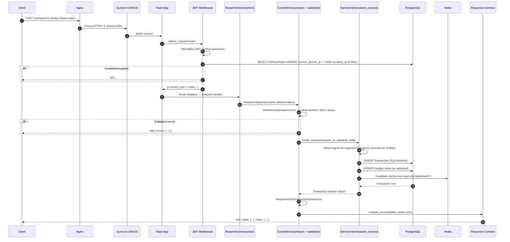
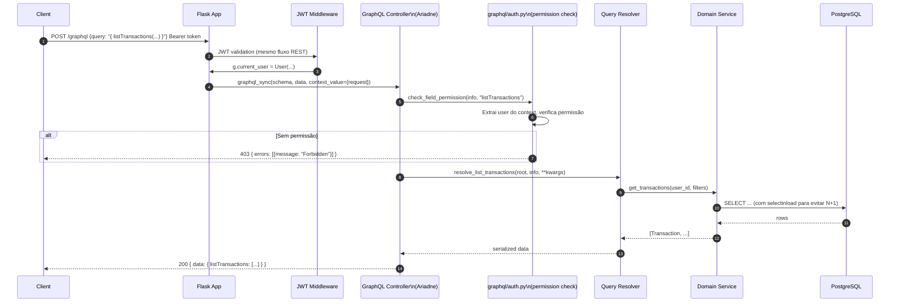
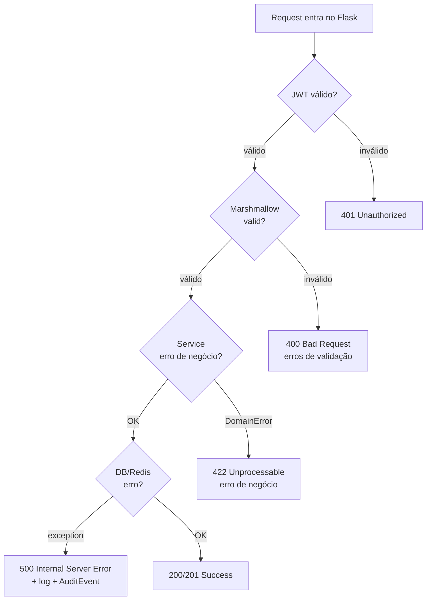

# 06 — Request Lifecycle

Ciclo de vida completo de uma requisição REST autenticada, do cliente ao banco de dados.

## REST — request autenticado (ex: POST /transactions)

## GraphQL — query autenticada (ex: listTransactions)

## Tratamento de erros — camadas

