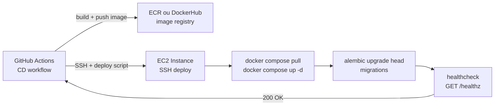

# 07 — AWS Deployment

Infraestrutura de produção na AWS (us-east-1).

## Topologia de infraestrutura

```mermaid
graph TB
    subgraph Internet
        USER[Usuário / Browser / App]
        STRIPE[Stripe Webhooks]
    end

    subgraph AWS["AWS — us-east-1"]
        subgraph CDN["CloudFront + S3 (auraxis-web)"]
            CF[CloudFront Distribution\napp.auraxis.com.br]
            S3[S3 Bucket\nauraxis-web-assets]
        end

        subgraph DNS["Route 53"]
            R53_WEB[app.auraxis.com.br → CloudFront]
            R53_API[api.auraxis.com.br → EC2]
        end

        subgraph ACM["ACM Certificates"]
            CERT[*.auraxis.com.br\nTLS 1.3]
        end

        subgraph EC2["EC2 — t3.medium (prod)"]
            direction TB
            NGINX[Nginx\nport 443/80\nTLS termination]

            subgraph COMPOSE["Docker Compose"]
                API[auraxis-api\nGunicorn 4 workers\nport 8000]
                WORKER[Celery Worker\n(scheduled jobs)]
            end

            NGINX --> API
        end

        subgraph RDS["RDS — db.t3.small"]
            PG[PostgreSQL 15\nMulti-AZ disabled\nbackups diários 7d]
        end

        subgraph ELASTICACHE["ElastiCache"]
            REDIS[Redis 7\ncache.t3.micro\nno replica]
        end

        subgraph SECRETS["Secrets Manager"]
            SM[DATABASE_URL\nREDIS_URL\nJWT_SECRET\nSTRIPE_KEY\nOPENAI_KEY\nMAILGUN_KEY]
        end

        subgraph MONITORING["CloudWatch"]
            CW_LOGS[Log Groups\n/auraxis/api\n/auraxis/nginx]
            CW_ALARMS[Alarms\nCPU, Memory, Error Rate\nRDS Connections]
            SNS[SNS → E-mail\nalerts@auraxis.com.br]
        end
    end

    USER -->|HTTPS| CF
    USER -->|HTTPS| NGINX
    STRIPE -->|HTTPS webhook| NGINX
    CF --> S3
    CF -->|/api/* proxy| NGINX
    NGINX --> API
    API --> PG
    API --> REDIS
    API --> SM
    CW_ALARMS --> SNS
    CW_LOGS --> CW_ALARMS
    EC2 -.->|logs| CW_LOGS
    RDS -.->|metrics| CW_ALARMS
    ELASTICACHE -.->|metrics| CW_ALARMS
```

## Deploy pipeline (Docker Compose no EC2)



## Variáveis de ambiente (produção)

| Variável | Fonte | Descrição |
|----------|-------|-----------|
| `DATABASE_URL` | Secrets Manager | Connection string PostgreSQL |
| `REDIS_URL` | Secrets Manager | Connection string ElastiCache |
| `JWT_SECRET_KEY` | Secrets Manager | Chave HMAC para JWTs |
| `STRIPE_SECRET_KEY` | Secrets Manager | API key Stripe |
| `OPENAI_API_KEY` | Secrets Manager | API key OpenAI |
| `MAILGUN_API_KEY` | Secrets Manager | API key Mailgun |
| `FLASK_ENV` | EC2 env | `production` |
| `SONAR_TOKEN` | GitHub Secrets | SonarCloud CI |
| `GITHUB_TOKEN` | GitHub OIDC | Deploy federado |
