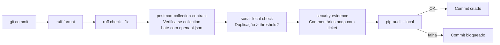
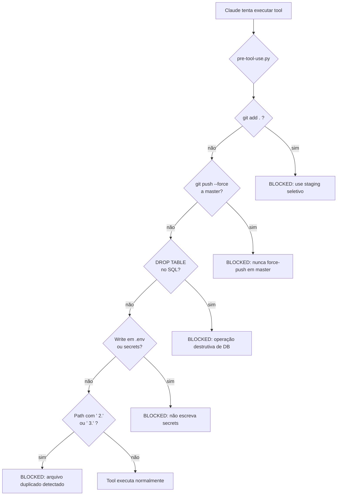

# 08 — CI/CD Pipeline

Pipeline de qualidade e entrega contínua via GitHub Actions.

## Fluxo completo de CI (push / PR)

```mermaid
flowchart TD
    PUSH[git push / PR aberto]

    subgraph CI["GitHub Actions — ci.yml"]
        FF[check_feature_flags\nGarante que flags não estão hardcoded]
        HYGIENE[repo_hygiene\nVerifica arquivos proibidos,\nduplicatas, TODOs críticos]
        GQL_AUTH[graphql_auth_config\nValida que todas as queries\ntêm @login_required]
        ALEMBIC[alembic_single_head\nGarante uma única cabeça\nde migration]
        SEC_EXC[security_exception_governance\nVerifica noqa de segurança\ncorretamente documentados]
        PIP_AUDIT[pip-audit\nScan de CVEs em dependências]
        RUFF_FMT[ruff format --check\nFormatação PEP 8]
        RUFF_CHK[ruff check\nLint + regras de qualidade]
        MYPY[mypy --strict\nType checking completo]
        BANDIT[bandit -r app\nSAST — vulnerabilidades OWASP]
        PYTEST[pytest --cov=app\n--cov-fail-under=85\nTestes + cobertura ≥ 85%]
        SONAR[SonarCloud Analysis\nDuplicação, smells, bugs]
        OASDIFF[openapi-diff\nDetecta breaking changes\nno contrato REST]
    end

    subgraph CD["GitHub Actions — cd.yml (master only)"]
        BUILD[docker build\nautomatico na main]
        DEPLOY[SSH → EC2\ndocker compose up -d]
        MIG_PROD[alembic upgrade head\nprod migrations]
        SMOKE[smoke test\nGET /healthz + /readiness]
    end

    PUSH --> FF
    FF --> HYGIENE
    HYGIENE --> GQL_AUTH
    GQL_AUTH --> ALEMBIC
    ALEMBIC --> SEC_EXC
    SEC_EXC --> PIP_AUDIT
    PIP_AUDIT --> RUFF_FMT
    RUFF_FMT --> RUFF_CHK
    RUFF_CHK --> MYPY
    MYPY --> BANDIT
    BANDIT --> PYTEST
    PYTEST --> SONAR
    SONAR --> OASDIFF

    OASDIFF -->|PR merged to master| BUILD
    BUILD --> DEPLOY
    DEPLOY --> MIG_PROD
    MIG_PROD --> SMOKE
    SMOKE -->|falha| ROLLBACK[Rollback automático\ndocker compose up --scale api=0\nrestore previous tag]
    SMOKE -->|200 OK| DONE[Deploy concluído]
```

## Pre-commit hooks (local)

Executados antes de cada `git commit` no repositório local:

## Claude Code hooks (agente IA)

Bloqueios no pre-tool-use para operações perigosas executadas por agentes:

## Quality gates e thresholds

| Gate | Ferramenta | Threshold | Bloqueia CI? |
|------|-----------|-----------|--------------|
| Cobertura de testes | pytest-cov | ≥ 85% | Sim |
| Duplicação de código | SonarCloud CPD | ≤ 3% linhas novas | Sim |
| Type coverage | mypy strict | 0 erros | Sim |
| Vulnerabilidades | bandit + pip-audit | 0 high/critical | Sim |
| Breaking changes API | oasdiff | 0 breaking | Sim (aviso em PR) |
| Lint | ruff | 0 erros | Sim |
